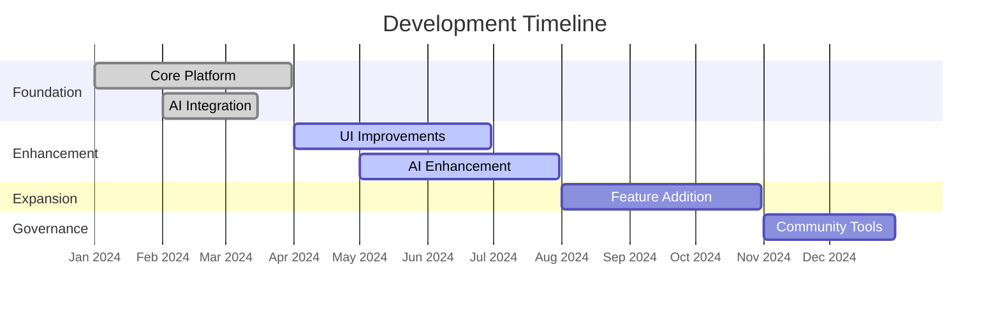

# Development Roadmap

**Protocol development timeline and milestones**

## Current Status

### Live Features

- Core staking platform for USDTu and USDT-ERC20 tokens
- LP token mechanics with hourly price updates
- Oracle system with smart contract integration
- Four-agent chat system for user support
- Waves blockchain integration

### Platform Components

- Staking interface at pupas.ai/staking
- AI chat system at pupas.ai/chat
- Oracle price updates via `updateLpPrice` method
- Multi-token support (USDTu and USDT-ERC20)

## Development Phases

### Phase 1: Foundation (Completed)

- Basic staking functionality
- LP token implementation
- Oracle integration
- Initial AI chat agents

### Phase 2: Enhancement (In Progress)

- Improved user interface
- Enhanced AI agent capabilities
- Additional security measures
- Performance optimizations

### Phase 3: Expansion (Planned)

- Multi-chain support evaluation
- Mobile interface development
- Advanced analytics features
- Community feedback integration

### Phase 4: Governance (Future)

- Community governance system
- Protocol upgrade mechanisms
- Decentralized decision making
- Long-term sustainability measures

## Technical Milestones

### Smart Contract Development

- Core staking contracts deployment
- Oracle integration completion
- Security audit implementation

### AI System Development

- Chat agent specialization
- Response accuracy improvements
- Context awareness enhancement
- Performance monitoring systems
- Additional tools for AI agents

### Platform Development

- Web interface optimization
- Mobile responsiveness
- User experience improvements
- Analytics dashboard creation

## Timeline Overview

## Community Participation

### Feedback Channels

- Feature request submissions
- User experience feedback

### Testing Opportunities

- Interface usability testing
- Performance feedback provision

## Development Priorities

### Current Focus Areas

- User interface improvements
- AI agent response quality
- System performance optimization

### Future Considerations

- Additional blockchain support
- Mobile application development
- Advanced analytics features
- Community governance tools
- Additional investment strategies


**Development Updates**

Development timeline may adjust based on technical requirements, security considerations, and community feedback. All dates are estimates subject to change.


## Success Indicators

### Technical Metrics

- System uptime and reliability
- User interface responsiveness
- AI agent accuracy rates
- Security incident prevention

### Community Metrics

- User feedback quality
- Community participation levels
- Feature adoption rates
- Support ticket resolution

---

*This roadmap reflects our current development priorities and may be updated based on community needs and technical requirements.* 